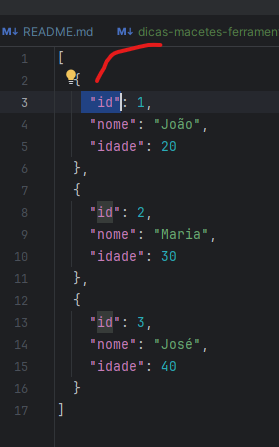

# dicas-macetes-ferramentas

> [!IMPORTANT]
> Lista de artigos/dicas:

- Dominando git
    - https://github.com/joshnh/Git-Commands
- Dicas IntelliJ
    - https://www.jetbrains.com/help/idea/mastering-keyboard-shortcuts.html
    - https://www.jetbrains.com/guide/go/tips/select-all-occurrences-in-a-file/#:~:text=Do%20you%20want%20to%20select,were%20all%20the%20same%20one.
        - selecionar todas as ocorrencias de uma palavra: `ctrl + shift + alt + j`

# Dicas IntelliJ - Manipulação de arquivos json por exemplo

>Pressupomos que precisamos extrair apenas o campo "id" do arquivo abaixo, com ajuda da IDE + Regex podemos fazer isso facilmente:

```json
[
  {
    "id": 1,
    "nome": "João",
    "idade": 20
  },
  {
    "id": 2,
    "nome": "Maria",
    "idade": 30
  },
  {
    "id": 3,
    "nome": "José",
    "idade": 40
  }
]
```

>Com arquivo acima aberto na IDE podemos fazer o seguinte:
> - selecione com mouse o campo "id" de um dos objetos, da seguinte forma:
>   - 
>   - O segredo é, tem que ter um padrão, e esse padrão tem que se repetir em todos os objetos, no caso acima o padrão é: `"id".
>   - Caso esse padrão não se repita, não tem como fazer isso, pois a IDE não vai conseguir identificar o padrão.
> - pressione `ctrl + shift + alt + j` para selecionar todas as ocorrencias de "id"
> - Deve ficar da seguinte forma a seleção:
> - 
> - Macete:
>   - Uma vez que o padrão de seleção foi identificado, então com `shift` pressionado, continue a seleção usando as setas do teclado, para cima ou para baixo, até que todas as ocorrencias sejam selecionadas.      
> - pressione `ctrl + c` para copiar, e cole em outro arquivo, deve ficar da seguinte forma:
> - ```text
>   "id": 1
>   "id": 2
>   "id": 3
> - ```
> - Pressione `ctrl + r` para abrir a janela de substituição, e no campo "Text to find" digite: `$`, em expressão regular, esse caracter indica que a ocorrência está no final da linha e no campo "Replace with" digite por exemplo: `;`, ou seja vamos inserir virgula no final.
> - Deve ficar da seguinte forma:
> - ```text
>   "id": 1,
>   "id": 2,
>   "id": 3,
>   ```
>   Finalmente, selecione todo texto e faça um "join" de linha, pressionando `ctrl + shift + j`, deve ficar da seguinte forma:
> - ```text
>   "id": 1, "id": 2, "id": 3,
>   ```
>   Pronto, agora é só copiar e colar onde precisar.

